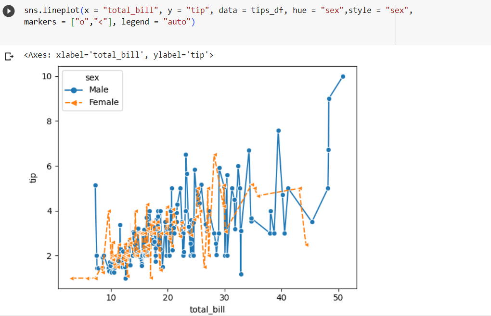

# Ex-08-Data-Visualization-

## AIM
To Perform Data Visualization on a complex dataset and save the data to a file. 

# Explanation
Data visualization is the graphical representation of information and data. By using visual elements like charts, graphs, and maps, data visualization tools provide an accessible way to see and understand trends, outliers, and patterns in data.

# ALGORITHM
### STEP 1
Read the given Data
### STEP 2
Clean the Data Set using Data Cleaning Process
### STEP 3
Apply Feature generation and selection techniques to all the features of the data set
### STEP 4
Apply data visualization techniques to identify the patterns of the data.


# CODE
```
DEVELOPED BY : MADHAN BABU P
REGISTER NUMBER: 212222230075

import pandas as pd
import seaborn as sns
import matplotlib.pyplot as plt
tips_df=sns.load_dataset("tips")
tips_df
sns.barplot(data = tips_df,x = "total_bill",y = "day")
sns.relplot(data = tips_df,x = "total_bill", y="tip",hue = "smoker", style = "smoker")
sns.displot(data = tips_df,x = "total_bill", y="tip",hue = "smoker")
sns.barplot(data = tips_df,x = "total_bill", y="tip",hue = "smoker")
sns.kdeplot(data = tips_df, x ="total_bill", y = "tip", size ="size")
sns.relplot(data = tips_df, x ="total_bill", y = "tip", hue = "day", col = "time")
sns.relplot(data = tips_df, x = "total_bill",y = "tip", col="day",col_wrap=2)
sns.lineplot(x = "total_bill", y = "tip", data = tips_df, hue = "sex",
style = "sex",
markers = ["o","<"], legend = "auto")
```

# OUPUT



# RESULT
The Data Visuvalisation has been performed sucssessfully